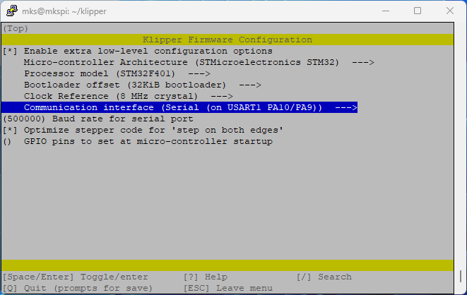
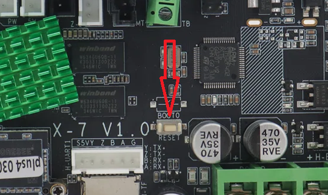
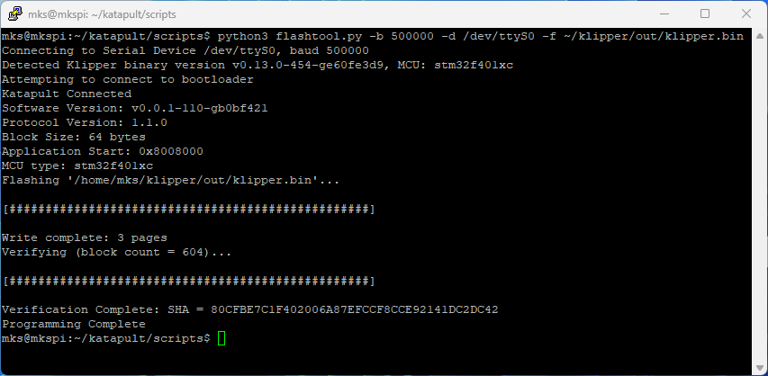
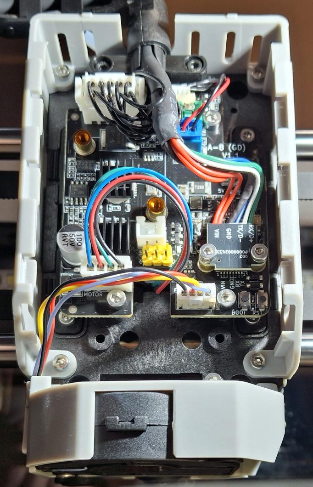
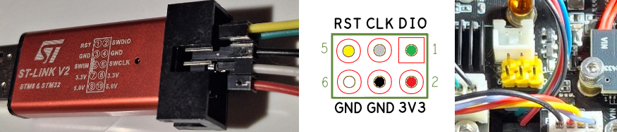
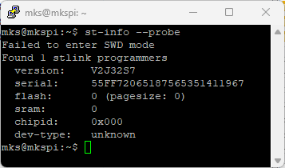
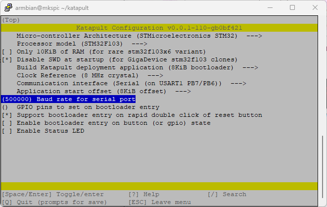
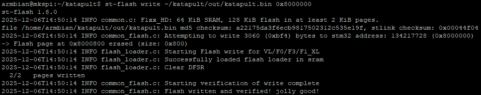
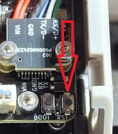
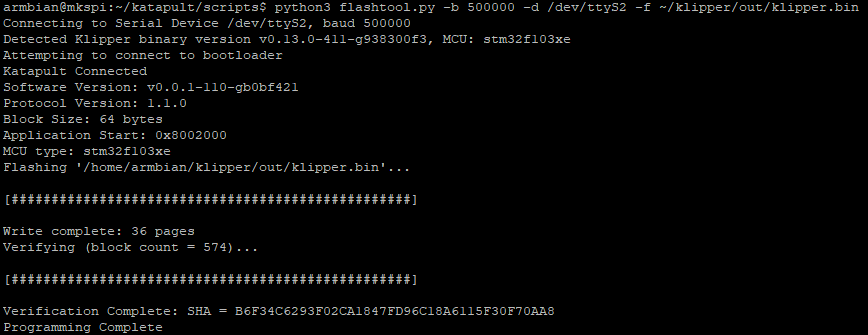

# Qidi Plus 4 Mainline Klipper/Kalico Guide with MKS-PI Armbian image

# ⚠️ WARNING

**absolutely no guarantees, you do everything at your own risk.**  

This is **work in progress**. Do not use any of these configs or instructions unless you know what you're doing!
These modifications are for experienced users. If you are not comfortable with a command line, linux, and electronics, please stop here!

**ALSO NOTE: YOUR OEM SCREEN AND QIDI BOX WILL NOT WORK AFTER FOLLOWING THESE STEPS**

You can opt to replace the screen and move to a KlipperScreen setup to get a functioning display.

Another option to use the OEM screen is [Klipmin](https://github.com/ctbenergy/qidi-plus4-klipmi)

# Credits

- [redrathnure](https://github.com/redrathnure) for MKS-PI Armbian image 
- [phrac](https://github.com/phrac) for Qidi Plus 4 Mainline flashing
- [DrFate09](https://github.com/DrFate09) for Qidi Plus 4 Mainline configuration
- [frap129](https://github.com/frap129) for [Klip]per for H[MI] displays like TJC and Nextion

# Introduction

Flashing mainline klipper/kalico on the Qidi Plus4 is relatively easy but does require some effort to flash the toolhead board. You will need an ST-Link programmer or clone to flash the toolhead.

# Backup

Before proceeding, backup any and all data in your printer configs, particularly your `printer.cfg`, `gcode_macros.cfg` and any other files
you may want to save. This can be done via the fluidd interface.

# Flashing the host with an updated Armbian image

redrathnure MKS-PI now merged in armbian build (https://github.com/armbian/build/pull/7553).

## Tools required:

* USB EMMC reader such as [this one](https://www.amazon.com/Vacatga-Adapter-EMMC-Adapter-52-6x16x10mm-2-07x0-63x0-39in/dp/B0D1MY7943?gQT=1)
* A spare eMMC card (optional but recommended) if you want to preserve the original stock card

## Flashing Steps

1. Power down your printer and remove the eMMC card from the printer motherboard. It is held down with 2 screws.
2. Download the following image:
   - Community maintained armbian MKS PI (https://www.armbian.com/mks-pi/).
   - Debian 13 Trixie Image (https://dl.armbian.com/mkspi/Trixie_current_minimal) .
3. Write the image to your eMMC card via your preferred method (Rufus, Balena Etcher, dd, etc)

4. Automatic first boot configuration
* If you need wireless networking then following this guide (https://docs.armbian.com/User-Guide_Autoconfig/).

5. Unmount the eMMC card and re-install it into your printer and power on. If everything worked, you should now be able to access your printer via SSH.
6. SSH into your printer.
* Using the default username `root` and the password is `1234`
7. Install updates
    Lets make sure our system is up-to-date with the latest software.
    ```
    sudo apt update && sudo apt upgrade
    sudo apt install git -y
    ```
### Disable debug console

By default, the Plus4 uses `/dev/ttyS2` to communicate with the toolhead. The fresh armbian image you just flashed uses `/dev/ttyS2` as a
kernel debug console, so we need to disable that:
```bash
echo 'console=none' > sudo tee -a /boot/armbianEnv.txt

# Grant user permissions and prevent getty from taking over the port
echo 'KERNEL=="ttyS2",MODE="0660"' > /etc/udev/rules.d/99-ttyS2.rules
systemctl mask serial-getty@ttyS2.service
```

For more information on these changes, see here: https://github.com/redrathnure/armbian-mkspi?tab=readme-ov-file#disable-debug-console-uart2--or-freeup-uart1-interface

### USB autosuspend

```bash
echo 'extraargs=usbcore.autosuspend=-1' > sudo tee -a /boot/armbianEnv.txt
```

## Installing klipper/kalico, moonraker, fluidd/mainsail and friends

Now that we have a clean, fresh system, we can start installing the software needed to run the printer. If you want to do this manually, you certainly can.
For everyone else, I recommend installing KIAUH.

## Installing KIAUH

KIAUH is a helper script to install klipper/kalico, mainsail, fluidd, crowsnest, moonraker, and many other things you may need or want.
The following steps will get KIAUH installed:

```bash
  cd ~
  git clone https://github.com/dw-0/kiauh.git
  ./kiauh/kiauh.sh
```

You will now be entered into the KIAUH main menu where you can install the software needed. At a minium install
* Klipper (or Kalico)
* moonraker
* fluidd (or mainsail)

KIAUH should automatically install all the required modules and start the services for you.

After everything is installed, we can move our backed up configurations over to the new setup:
Copy your `printer.cfg` and `gcode_macros` to `~/printer_data/config`

# Flashing the main MCU

## Flashing Katapult Deployer

These steps will build the Katapult deployer application. Make sure that you already have your ST-LINK programmer (or clone) on hand. If something goes wrong,
you will have to recover with the programmer. [Further details of Katapult deployer can be found here.](https://github.com/Arksine/katapult?tab=readme-ov-file#katapult-deployer)

1. SSH into your printer
2. Download Katapult and configure for the main board:
    ```
    cd ~/
    git clone https://github.com/Arksine/katapult
    cd katapult
    make menuconfig
    ```
    Once you are in `make menuconfig`, you want to build katapult with the following options:
    

    After you are sure your menuconfig matches the above settings, you can quit menuconfig (press q then y to save)
3. run `make -j4` to build katapult
4. Copy `~/katapult/out/deployer.bin` to your computer via your favorite method (scp, sftp, or using the fluidd interface)
5. On your computer, format the microSD card as FAT32
6. Copy the `deployer.bin` file to the microSD card and rename it `qd_mcu.bin`
7. Eject the microSD card and plug it into the microSD card slot on the printer.
8. Once the card is inserted, find the button labeled "RESET" on the main board and press it
9. Wait 30-60 seconds
    - You can verify that the flash worked by checking the file on the microSD card - it should be renamed to `qd_mcu.CUR`
10. Eject the microSD card. Katapult should now be flashed to the main MCU.

Update Katapult Deployer from Github.

```
cd ~/katapult
git pull origin master
```

## Flashing Klipper on the main MCU

1. SSH into your printer
2. Install the `pyserial` Python package. This package is needed to run the katapult flashtool script.
   ```
   python -m pip install pyserial
   ```
4. Execute the following to build Klipper
    ```
    cd ~/klipper
    make menuconfig
    ```
    Configure the make arguments in `menuconfig` to match these settings:
    

5. Save and quit by pressing `q` then `y` to save
6. Build klipper by running `make clean; make -j4`
7. Prepare to flash. Double-click the "RESET" button on the board to load   katapult. The button must be pressed twice within 500ms.

8. Flash via katapult by doing the following:
    ```
    cd ~/katapult/scripts
    python3 flashtool.py -b 500000 -d /dev/ttyS0 -f ~/klipper/out/klipper.bin
    ```
    You should see output similar to the following if the flash worked:
    
9. Klipper is now flashed to the main MCU. We can now move on to the toolhead.

<!--
```bash
mks@mkspi:~/katapult/scripts$ python3 flashtool.py -b 500000 -d /dev/ttyS0 -f ~/klipper/out/klipper.bin
Connecting to Serial Device /dev/ttyS2, baud 500000
Detected Klipper binary version v0.13.0-454-ge60fe3d9, MCU: stm32f103xe
Attempting to connect to bootloader
Katapult Connected
Software Version: v0.0.1-110-gb0bf421
Protocol Version: 1.1.0
Block Size: 64 bytes
Application Start: 0x8008000
MCU type: stm32f401xc
Flashing '/home/mks/klipper/out/klipper.bin'...

[##################################################]

Write complete: 3 pages
Verifying (block count = 604)...

[##################################################]

Verification Complete: SHA = 80CFBE7C1F402006A87EFCCF8CCE92141DC2DC42
Programming Complete
```
--> 

# Flashing the toolhead MCU

The toolhead takes quite a bit more work to flash. You will need to solder some pins on the board and you will also need an ST-Link programmer (or clone).
The official ST-LINK programmer is what I used. You can purchase one from Digikey (or any other source). [This is the one I used](https://www.digikey.com/en/products/detail/stmicroelectronics/ST-LINK-V2/2214535)

## Preparing the toolhead

Begin by unsliding the back cover of the toolhead, disconnecting all connectors, and unscrewing the board from the toolhead.

[QIDI Plus4 | How to replace the adapter plates](https://www.youtube.com/watch?v=jD4cqVDlX6U)

Next, you need to solder a 6 pin header on the board like the below image:


Once the header is soldered, we need to wire it to the ST-LINK:


Use the following wiring diagram

```
+--- J1 6-Pin Connector ---+       +--- STLink V2 10-Pin Connector ---+
|                          |       |                                  |
| Pin 1: DIO   ------------|-------| Pin 2: SWDIO                     |
| Pin 3: CLK   ------------|-------| Pin 6: SWCLK                     |
| Pin 5: RST   ------------|-------| Pin 1: RST                       |
| Pin 6: GND   ------------|-------| Pin 3: GND                       |
| Pin 4: GND               |       | Pin 4: GND                       |
| Pin 2: 3V3   ------------|---+---| Pin 7: VDD                       |
|                          |   |   |                                  |
|                          |   |---| Pin 19: VDD                      |
|                          |       |                                  |
+--------------------------+       +----------------------------------+
```

## Flashing Katapult on the toolhead

I used the printer itself to flash the toolhead but you can use any other computer available to build and flash.

1. Plug your ST-Link into the top usb port of the printer
2. Install the ST-Link tools: `sudo apt install stlink-tools`
3. Check that your ST-Link is recognized (and recognizing the toolhead): `st-info --probe`. You should see output similar to this:

```bash
mks@mkspi:~$ st-info --probe
Found 1 stlink programmers
  version:    V2J32S7
  serial:     55FF72065187565351411967
  flash:      131072 (pagesize: 2048)
  sram:       65536
  chipid:     0x414
  dev-type:   F1xx_HD
```
<!---
  
--->

  Note that your output might not match exactly. What you are looking for is that it found an stlink programmer, and it detects a chip (above we see `chipid: 0x414` and `dev-type: F1xx_HD`).
  If you don't see these things, double check your wiring.

4. Next, we need to build katapult for the toolhead:
    ```
    cd ~/katapult
    make menuconfig
    ```

    Make sure your menuconfig matches this:

    

    ```
    make clean
    make -j4
    ```

5. Now we can flash katapult via the ST-Link:

    ```
    st-flash write ~/katapult/out/katapult.bin 0x8000000
    ```

    You should see a message like this:

    

<!--
```bash
mks@mkspi:~/katapult$ st-flash write ~/katapult/out/katapult.bin 0x8000000
st-flash 1.8.0
2025-12-06T14:50:14 INFO common.c: F1xx_HD: 64 KiB SRAM, 128 KiB flash in at least 2 KiB pages.
file /home/mks/katapult/out/katapult.bin md5 checksum: a22175da3f6ecb9817502312c535e19f, stlink checksum: 0x00044f04
2025-12-06T14:50:14 INFO common_flash.c: Attempting to write 3060 (0xbf4) bytes to stm32 address: 134217728 (0x8000000)
-> Flash page at 0x8000800 erased (size: 0x800)
2025-12-06T14:50:14 INFO flash_loader.c: Starting Flash write for VL/F0/F3/F1_XL
2025-12-06T14:50:14 INFO flash_loader.c: Successfully loaded flash loader in sram
2025-12-06T14:50:14 INFO flash_loader.c: Clear DFSR
  2/2   pages written
2025-12-06T14:50:14 INFO common_flash.c: Starting verification of write complete
2025-12-06T14:50:14 INFO common_flash.c: Flash written and verified! jolly good!
```
--> 

6. Unhook your ST-Link from the USB port, disconnect all ST-Link wires from the toolhead, put the toolhead covers back onto the toolhead and reboot the printer.

## Flashing Klipper on the toolhead
This is the same basic process that we used to flash klipper on the main MCU
1. Build klipper
    ```
    cd ~/klipper
    make menuconfig
    ```
    Your menuconfig should match this for the toolhead:

    

    ```
    make clean
    make -j4
    ```
2. Double click the reset button on the toolhead within 500ms to enter Katapult

    

3. Flash klipper:
    ```
    cd ~/katapult/scripts
    python3 flashtool.py -b 500000 -d /dev/ttyS2 -f ~/klipper/out/klipper.bin
    ```
    You should see a successful flash like this:

    

<!--
```bash
mks@mkspi:~/katapult/scripts$ python3 flashtool.py -b 500000 -d /dev/ttyS2 -f ~/klipper/out/klipper.bin
Connecting to Serial Device /dev/ttyS2, baud 500000
Detected Klipper binary version v0.13.0-454-ge60fe3d9, MCU: stm32f103xe
Attempting to connect to bootloader
Katapult Connected
Software Version: v0.0.1-110-gb0bf421
Protocol Version: 1.1.0
Block Size: 64 bytes
Application Start: 0x8002000
MCU type: stm32f103xe
Flashing '/home/mks/klipper/out/klipper.bin'...

[##################################################]

Write complete: 36 pages
Verifying (block count = 575)...

[##################################################]

Verification Complete: SHA = 4C71B043812F67EECBAC1A641C231B8685D36226
Programming Complete
```
--> 

4. Reboot the printer and you're done - you can now start configuring!

# Configuring the newly flashed printer


# Plugins

## KAMP

[Klipper Adaptive Meshing & Purging](https://github.com/kyleisah/Klipper-Adaptive-Meshing-Purging) 

```bash
cd ~
git clone https://github.com/kyleisah/Klipper-Adaptive-Meshing-Purging.git
ln -s ~/Klipper-Adaptive-Meshing-Purging/Configuration printer_data/config/KAMP
cp ~/Klipper-Adaptive-Meshing-Purging/Configuration/KAMP_Settings.cfg ~/printer_data/config/KAMP_Settings.cfg
```

## Klipper Backup

[Klipper-Backup](https://github.com/Staubgeborener/Klipper-Backup.git) 

```bash
cd ~
git clone https://https://github.com/Staubgeborener/Klipper-Backup.git
```

```bash
Section 'gcode_shell_command update_git_script' is not a valid config section
```
## Beacon Klipper

[Beacon Klipper](https://github.com/beacon3d/beacon_klipper.git) 

```bash
Section 'beacon' is not a valid config section
```

### Install Beacon Module

Beacon Klipper require additional software dependencies not installed by default. First, run on your host the following commands:

```bash
sudo apt update
sudo apt install python3-numpy python3-matplotlib libopenblas-dev
```

Install script, clone `beacon_klipper` from git and run the install script:
```bash
cd ~
git clone https://github.com/beacon3d/beacon_klipper.git
./beacon_klipper/install.sh
```

```bash
beacon: installing python requirements to env, this may take 10+ minutes.
beacon: linking klippy to beacon.py.
beacon: installation successful.
Updating firmware.
Beacon '4E7A04345157383837202020FF02091C' is already flashed with the current firmware version '2.1.0'. Skipping.
To force update, re-run `update_firmware.py` with the `--force` flag set.
```

#### printer.cfg changes

First, on an ssh command shell to the printer, run ls /dev/serial/by-id/usb-Beacon* to find your Beacon serial number

```bash
mks@mkspi:~$ ls /dev/serial/by-id/usb-Beacon*
/dev/serial/by-id/usb-Beacon_Beacon_RevH_4E7A04345157383837202020FF02091C-if00
```

Beacon3D RevH Normal Installation and Configuration Guide
https://github.com/qidi-community/Plus4-Wiki/blob/main/content/bed-scanning-probes/Beacon3D/RevH-Normal/README.md

Beacon Probe USB Cable Mount for Chain Cable Qidi Plus 4
https://cults3d.com/en/3d-model/tool/beacon-probe-usb-cable-mount-for-chain-cable-qidi-plus-4?utm_source=chatgpt.com

Beacon3D mount for Qidi Plus4
https://www.printables.com/model/1170120-beacon3d-mount-for-qidi-plus4/comments


## Klippain-ShakeTune

[Klipper Shake&Tune plugin](https://github.com/Frix-x/klippain-shaketune.git) 

Install script, execute the following command over SSH:
```bash
wget -O - https://raw.githubusercontent.com/Frix-x/klippain/main/install.sh | bash
```

Uninstall script, execute the following command over SSH:
```bash
cd ~
wget -O - https://raw.githubusercontent.com/Frix-x/klippain/main/uninstall.sh | bash
```

---
# Other References and Resources
- Instructions for flashing and running mainline (vanilla) Klipper or Kalico on the Qidi Plus4: https://github.com/phrac/plus4_kalico/tree/main
